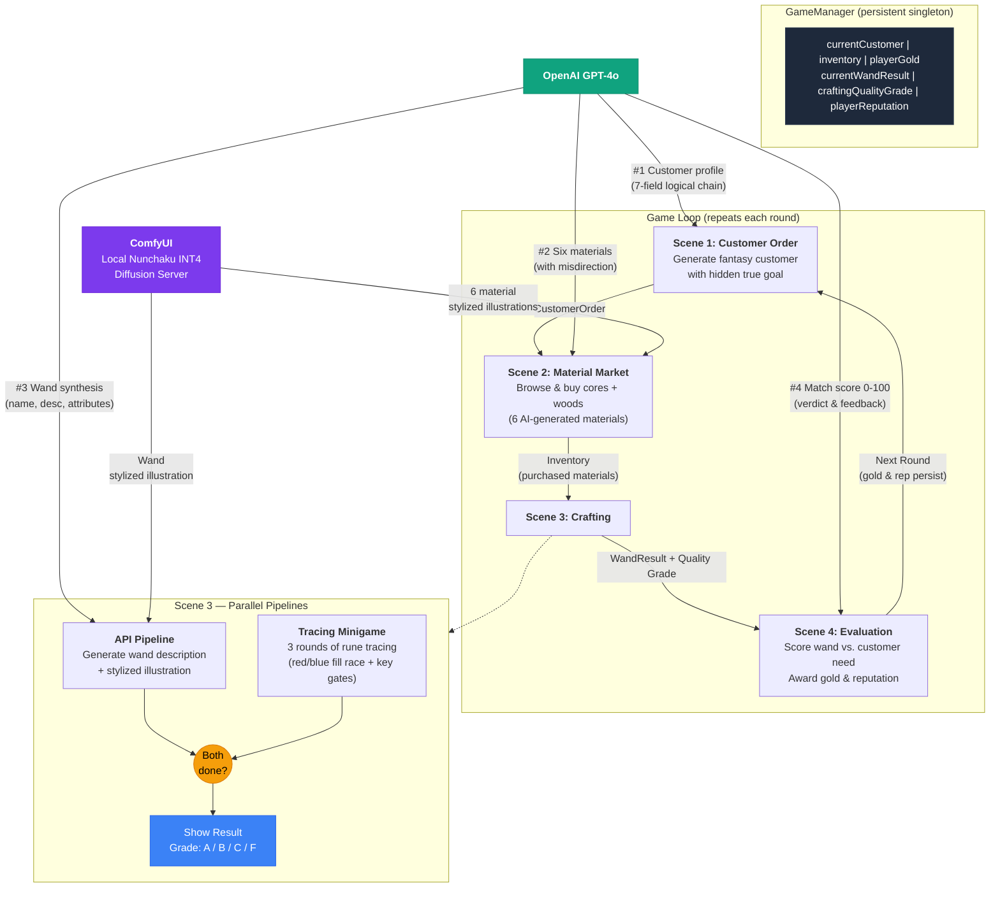

# The Wand Atelier

A cozy fantasy shop game where you read between the lines of quirky AI-generated customers' requests, hunt for the perfect magical materials, and trace rune patterns under pressure — then watch as your crafted wand is conjured into a unique stylized illustration and scored against what the customer truly wanted.

A 7-day session loop ties it together: each morning brings a letter, each afternoon brings a customer, and your reputation steers the run toward one of five hand-authored endings.

---

## ⚠️ Disclaimer — required runtime conditions

This project will **not run** unless **all** of the following are true. There is no offline / mock mode; every gameplay round makes live calls to OpenAI and to a locally hosted ComfyUI server.

- **Unity 6000.0.58f2 (Unity 6) with URP.** Older Unity versions hit a TextCore SDF font interop gap that breaks dossier rendering.
- **Windows 10 / 11 with an NVIDIA GPU, 8 GB+ VRAM** (RTX 30/40 class). The image pipeline depends on Nunchaku INT4 quantisation, which is CUDA/Windows-tested only here. macOS and AMD GPUs are untested.
- **An OpenAI API key with GPT-4o access**, placed at `Assets/StreamingAssets/config.json` as:
  ```json
  { "openAIApiKey": "sk-..." }
  ```
  This file is `.gitignore`-d, so every fresh clone has to recreate it. If absent, customer / material / wand / evaluation calls all log `no API key found in StreamingAssets/config.json` and the run halts.
- **A ComfyUI server reachable at `http://127.0.0.1:8000`** (the default, overridable on `MaterialGenerator`, `MorningScreenController`, `MinigameSceneRunner`, and `CustomerGenerator` Inspectors).
- **The Nunchaku INT4 build of Z-Image Turbo** (`svdq-int4_r32-z-image-turbo.safetensors`) loaded with the `qwen_3_4b` CLIP encoder. The C# pipeline references node IDs `5` (CLIPTextEncode) and `4` (KSampler) by default, and falls back to a `class_type` lookup via `MaterialService.FindNodeByClass` if your workflow uses different IDs.
- **The workflow JSON `Assets/StreamingAssets/image_z_image_turbo.json`** must be present and well-formed. The C# pipeline POSTs it verbatim to ComfyUI's `/prompt`, then polls `/history/{id}` and downloads via `/view`.
- **All 8 production scenes in Build Settings, in order:** `0.TitleScene`, `1.MorningScene`, `2.CustomerGeneratorTest`, `3.MaterialGeneratorTest`, `4.CraftingScene`, `5.MinigameTest`, `6.EvaluationScene`, `7.EndingScene`. `GameManager.LoadScene` resolves by suffix-match, so a missing scene breaks navigation.
- **Internet access** for OpenAI. ComfyUI runs offline once installed and the model is downloaded.

---

## Setup

1. **Install Unity Hub** and add Unity **6000.0.58f2** (Unity 6). Open this folder via the Hub. Let the first import + package resolve finish — the URP, Input System, and Newtonsoft.Json packages are in `Packages/manifest.json` and pull on first open.

2. **Add your OpenAI key.** Create `Assets/StreamingAssets/config.json`:
   ```json
   { "openAIApiKey": "sk-proj-YOUR_KEY_HERE" }
   ```
   Don't commit it — `.gitignore` already excludes it.

3. **Install ComfyUI.** Either the desktop app or the [github.com/comfyanonymous/ComfyUI](https://github.com/comfyanonymous/ComfyUI) repo running inside a Python 3.12 venv (this project was built against `C:\.venv`). Install Nunchaku per their README — on Windows, the lazy-weight-loading patch is required.

4. **Download the model files** referenced by `Assets/StreamingAssets/image_z_image_turbo.json`:
   - `svdq-int4_r32-z-image-turbo.safetensors` (Nunchaku INT4 Z-Image Turbo)
   - `qwen_3_4b` CLIP encoder
   Drop them into ComfyUI's `models/` tree at the locations the workflow JSON expects (filenames are referenced as-is — no path rewriting).

5. **Launch ComfyUI** so it serves on `http://127.0.0.1:8000`. The first generation takes ~30 s while the model warms up; subsequent generations are 3–6 s on an RTX 4070 Laptop.

6. **Open `Assets/Scenes/0.TitleScene.unity`** in Unity and press Play. Click *Begin* on the title screen → morning letter types out → market → crafting → minigame → evaluation → next day. Seven days loop into one of five endings.

> Want to inspect the endings without playing through? Open `Assets/Scenes/SampleScene.unity` and press Play — the `EndingTestRunner` IMGUI panel exposes one button per ending variant.

---

## Architecture



### Per-round AI calls

| # | Scene | Service | Purpose |
|---|-------|---------|---------|
| 1 | Customer Order   | GPT-4o  | Generate customer with hidden true goal & constraint |
| 2 | Material Market  | GPT-4o  | Generate 6 materials (3 cores + 3 woods) with misdirection |
| 3 | Material Market  | ComfyUI | Generate 6 stylized material illustrations (parallel) |
| 4 | Crafting         | GPT-4o  | Synthesize wand from selected materials |
| 5 | Crafting         | ComfyUI | Generate wand stylized illustration |
| 6 | Evaluation       | GPT-4o  | Score wand match (0–100) with detailed feedback |

A *parallel pre-generation cascade* (kicked off at morning-letter time and continued across scene loads on the persistent `GameManager` host) hides most of the cumulative AI latency behind gameplay.

---

## Tech stack

- **Engine:** Unity 6 (`6000.0.58f2`) with URP
- **Language AI:** OpenAI GPT-4o (chat completions, JSON-only responses)
- **Image AI:** ComfyUI hosting Nunchaku INT4-quantized Z-Image Turbo
- **JSON:** Newtonsoft.Json (`JObject` / `JArray`)
- **UI:** UI Toolkit (UXML / USS) for production scenes; uGUI + TextMeshPro for the ending and a few legacy hosts
- **Input:** New Input System (used by the tracing minigame's mouse-warp)

---

## Project structure

```
Assets/
  Scenes/
    0.TitleScene           — start screen
    1.MorningScene         — letter + day plaque
    2.CustomerGeneratorTest — dossier (memo gate)
    3.MaterialGeneratorTest — market
    4.CraftingScene        — 2-core + 1-wood selection
    5.MinigameTest         — tracing ritual + parallel wand-gen
    6.EvaluationScene      — theatrical reveal + reward
    7.EndingScene          — one of five outcomes
    SampleScene            — `EndingTestRunner` (no API/ComfyUI needed)
  Scripts/                 — flat C# layout, see CLAUDE.md
  StreamingAssets/
    config.json            — your OpenAI key (gitignored)
    image_z_image_turbo.json — ComfyUI workflow
  UI/                      — per-scene UXML + USS
  Texture/Ending Illustrations/ — five pre-generated PNGs
```

---

## Troubleshooting

- **Console logs `no API key found in StreamingAssets/config.json`** — `Assets/StreamingAssets/config.json` is missing or malformed. Re-create per Setup step 2.
- **ComfyUI calls fail with `Cannot connect to destination host` or `404 /prompt`** — ComfyUI isn't running on `127.0.0.1:8000`, or the workflow JSON references models you haven't downloaded. Open `127.0.0.1:8000` in a browser to confirm the server is up; check ComfyUI's own log for missing model files.
- **`MaterialService.FindNodeByClass` warns about missing nodes** — your `image_z_image_turbo.json` doesn't have a `CLIPTextEncode` (default node `5`) or `KSampler` (default `4`). Either restore the original workflow JSON or override `clipNodeId` / `ksamplerNodeId` on the relevant scene managers.
- **`Scene 'X' not found in build settings`** — open *File → Build Profiles* and confirm the 8 numbered scenes are listed *in numerical order* and all enabled.
- **First image generation takes 30+ seconds** — normal: ComfyUI is loading the Z-Image Turbo weights into VRAM. Subsequent images are 3–6 s.
- **Endings show a tinted placeholder instead of an illustration** — `EndingManager` Inspector slots are unwired. Open `7.EndingScene.unity`, select `EndingManager`, drag each PNG from `Assets/Texture/Ending Illustrations/` into the matching slot.

---

## References

- [`CLAUDE.md`](CLAUDE.md) — deep architecture, conventions, file-safety rules, AI-team workflow.
- [`Docs/GDD.md`](Docs/GDD.md) — full game design document.
- [`Docs/SevenDayProgression.md`](Docs/SevenDayProgression.md) — letters, rent, ending thresholds.
- [`Docs/MemoFeature.md`](Docs/MemoFeature.md) — drag-to-highlight reading mechanic.
- [`.claude/Final Report/Final_Report.md`](.claude/Final%20Report/Final_Report.md) — academic write-up of the project.
